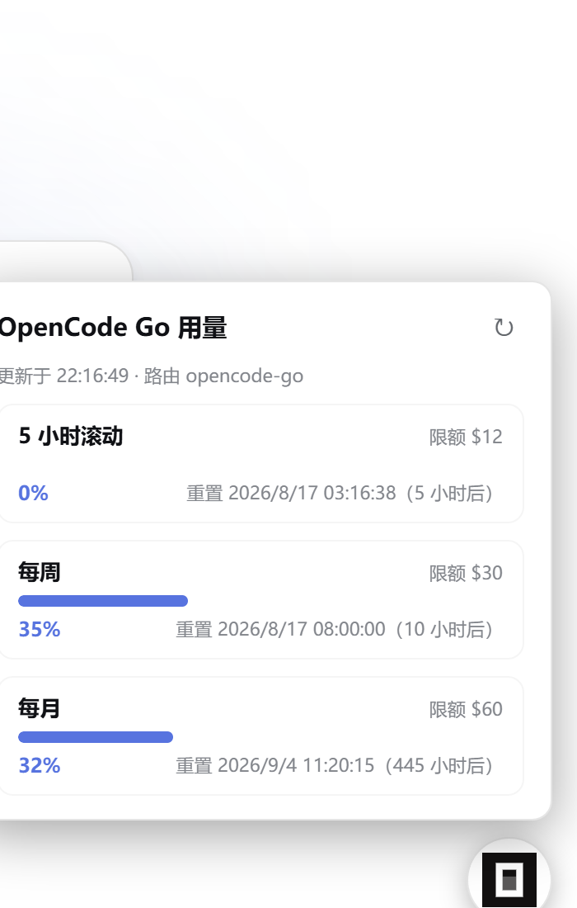

# dsh-plugin-opencode-go-quota

<p align="center">
  
  
  
</p>

OpenCode Go 额度悬浮窗 —— DeepSeek Harness (DSH) Web GUI 插件。

> 本插件由 **DeepSeek V4 Flash**（`deepseek-v4-flash`）开发，全程在 DSH 会话中完成设计、实现、调试与发布。

页面右下角**圆形悬浮按钮**（opencode 官方图标，**可鼠标拖动**），点击展开**弹窗**
展示当前所选 OpenCode Go 账号套餐各周期额度（5 小时滚动 / 每周 / 每月）的已用
百分比、限额与重置时间；再点按钮或 × 收起。弹窗打开期间每 5 分钟自动刷新。

**核心行为**：仅当当前会话选中的模型属于 opencode go 系 provider 时才显示按钮，
切换到其他模型（如 deepseek-official）自动隐藏；多 opencode go 账号（含自定义
路由）按所选 provider 自动对应各自的 API key 与额度。



## 安装

### 方式一：从 GitHub 安装（推荐）

```bash
dsh plugin --profile web add github:haipisao/dsh-plugin-opencode-go-quota
```

### 方式二：从打包 tarball 安装

```bash
# npm pack 产物（本地 `npm pack` 生成，或从 GitHub Releases 下载）
dsh plugin --profile web add ./dsh-plugin-opencode-go-quota-0.1.1.tgz
```

### 方式三：本地源码目录（开发调试）

```bash
dsh plugin --profile web add ./packages/dsh-plugin-opencode-go-quota
```

### 注册行（三种方式都需要）

在 `~/.dsh/profiles/web/cordis.patch.yml` 追加（HMR 注册即生效，无需重启）：

```yaml
- insert:
    - id: opencode-go-quota
      name: dsh-plugin-opencode-go-quota
      config:
        timeoutMs: 15000
        visibleProviders: [opencode-go, opencode-go-2]
        providers:
          opencode-go:
            usageUrl: https://opencode.ai/zen/go/v1/usage
            keyRef: OPENCODE_GO_API_KEY
          opencode-go-2:
            usageUrl: https://opencode.ai/zen/go/v1/usage
            keyRef: OPENCODE_GO_API_KEY_2
```

> 首次安装新 bundle 后，若 HMR 未生效，重启一次 `dsh web` 即可。

## 交给 Agent 安装（提示词模板）

把下面整段复制给任意 AI agent（DSH 会话或其他助手），即可由它完成安装与验证：

````text
请帮我安装 DSH 插件 dsh-plugin-opencode-go-quota（OpenCode Go 额度悬浮窗，GitHub: haipisao/dsh-plugin-opencode-go-quota）。

执行步骤：
1. 安装插件包（二选一）：
   - dsh plugin --profile web add github:haipisao/dsh-plugin-opencode-go-quota
   - 或本地 tarball：dsh plugin --profile web add ./dsh-plugin-opencode-go-quota-0.1.1.tgz
2. 在 ~/.dsh/profiles/web/cordis.patch.yml 追加注册行（若已存在相同 id 则跳过，不要重复插入）：
   - insert:
       - id: opencode-go-quota
         name: dsh-plugin-opencode-go-quota
         config:
           timeoutMs: 15000
           visibleProviders: [opencode-go, opencode-go-2]
           providers:
             opencode-go:
               usageUrl: https://opencode.ai/zen/go/v1/usage
               keyRef: OPENCODE_GO_API_KEY
             opencode-go-2:
               usageUrl: https://opencode.ai/zen/go/v1/usage
               keyRef: OPENCODE_GO_API_KEY_2
3. 确认 API key 已配置在 DSH credentials seam（~/.dsh/.credentials.yaml 或进程环境变量）：
   OPENCODE_GO_API_KEY（账号 1）、OPENCODE_GO_API_KEY_2（账号 2，可选）；
   auth.json 兜底仅在未显式配置 keyRef 时（默认 opencode-go 场景）生效，按平台探测路径。
4. 验证（全部通过才算完成）：
   - dsh --profile web --dump-config | grep opencode-go-quota        # 注册行已挂载
   - curl "http://127.0.0.1:3080/opencode-go-quota/api/usage?provider=opencode-go-2"
       → 返回 visible:true 且 usage 含 rolling/weekly/monthly 三个窗口
   - curl "http://127.0.0.1:3080/opencode-go-quota/api/usage?provider=deepseek-official"
       → 返回 visible:false（其他模型必须隐藏）
   - curl "http://127.0.0.1:3080/plugins/dsh-plugin-opencode-go-quota/client.js" → 200
   - 刷新页面，选中 opencode go 系模型后右下角出现可拖动的图标按钮；切到其他模型自动隐藏
5. 注意：
   - 首次安装新 bundle 若路由 404（HMR 未生效），重启一次 dsh web；
   - 不要修改插件源码；config 覆盖请通过注册行 config 完成；
   - 若页面未出现按钮，优先检查第 3 步 key 与第 4 步 visible 判定。
````

## 使用

1. 刷新页面，在「设置 → 模型」里确保有 opencode-go 系 provider（Anthropic 或
   openai-completions 风格均可），并配置对应 API key：
   - `OPENCODE_GO_API_KEY`（credentials seam：`~/.dsh/.credentials.yaml` 或环境变量）
   - 第二个账号 `OPENCODE_GO_API_KEY_2`（如需）
   - 未显式配置 keyRef 时（默认 `opencode-go` 场景），host 会回退读 OpenCode CLI
     的 `auth.json`（按平台探测：Windows `%LOCALAPPDATA%/opencode`、macOS
     `~/Library/Application Support/opencode`、Linux `~/.local/share/opencode`，
     可用 `OPENCODE_GO_AUTH_PATH` 覆盖）；其余 provider 缺 key 会明确提示
     「未找到 API Key」，绝不静默串用其他账号的 key
2. 把会话模型切到 opencode go 系（如 `opencode-go/deepseek-v4-flash`）——
   右下角出现 opencode 图标按钮（可拖动）。
3. 点击按钮展开弹窗：三个周期额度（百分比进度条 + 限额 + 重置时间）、
   当前「路由」标识、手动刷新；再点按钮或 × 收起。
4. 切到其他模型 → 按钮自动隐藏。

## 卸载

```bash
dsh plugin --profile web remove dsh-plugin-opencode-go-quota
```

并删除 `~/.dsh/profiles/web/cordis.patch.yml` 里 `opencode-go-quota` 的 insert 注册行。
（实测：依赖、bundle 清单、node_modules 与注册行全部清除后，重启实例无任何残留。）

## 数据源

官方用量端点（接口未公开，解析为防御式），返回 `usage.rolling / usage.weekly / usage.monthly`
三个窗口的 `percent`（0–100）与 `resetsAt`（ISO-8601）。限额（`$12 / $30 / $60`）为
套餐静态值，仅作参考，可在配置里覆盖。

## host API（可选，自检用）

```
GET /opencode-go-quota/api/usage?provider=<llm-pi-ai 路由 id>
```

- `visible: true/false`：provider 是否在可见名单；未知 provider / 缺 key 返回
  结构化原因（`unknown-provider` / `no-api-key`），不抛错。
- key 与端点解析：`config.providers` 显式优先，否则从
  Settings → Models（llm-pi-ai）的 `apiKeyEnv` / `baseURL` 推导。

## 配置（注册行 config）

| Key | 默认 | 含义 |
| --- | --- | --- |
| `timeoutMs` | `15000` | 拉取超时（毫秒） |
| `visibleProviders` | `providers` 的键；缺省 `[opencode-go, opencode-go-2]` | 显示悬浮窗的 provider 名单 |
| `providers.<id>.usageUrl` | 设置推导（baseURL + `/usage`）或官方默认 | 该路由的用量端点 |
| `providers.<id>.keyRef` | 设置推导（apiKeyEnv） | 该路由的凭据引用（credentials seam / env） |
| `limits` | `$12/$30/$60` | 三周期限额显示文本 |

## 验证

> 以下命令中的 `3080` 为默认端口，实际端口以你的 `dsh web` 为准。

```bash
node --check lib/index.js && node --check lib/client.js
curl "http://127.0.0.1:3080/opencode-go-quota/api/usage?provider=opencode-go-2"     # visible:true + 该账号额度
curl "http://127.0.0.1:3080/opencode-go-quota/api/usage?provider=deepseek-official"  # visible:false
dsh --profile web --dump-config | grep opencode-go-quota                            # 注册行已挂载
```

## 结构

| 文件 | 角色 |
| --- | --- |
| `lib/index.js` | host 端：同源 API（读 key → 拉官方端点 → 按 provider 归一化返回） |
| `lib/client.js` | client 端 bundle：`shell.overlay` 槽位注入图标按钮 + 弹窗（手写 `window.__ModuleLoader__.load` 格式，免构建）；拖动、按选中模型显隐 |
| `cordis.patch.yml` | 空 patch（注册统一走 profile 层，避免重启后 duplicate loader entry id） |
| `index.js` | 兼容转发 shim，**仅开发热更场景用，不随 npm 包发布**（新进程直接按 main 加载 lib/index.js） |

## 支持与分享

觉得好用的话，求个 ⭐ 支持一下，也欢迎分享给需要的朋友：

- ⭐ Star：[https://github.com/haipisao/dsh-plugin-opencode-go-quota](https://github.com/haipisao/dsh-plugin-opencode-go-quota)
- 一键分享文案（直接复制）：

> DSH 插件推荐：OpenCode Go 额度悬浮窗 —— 右下角可拖动的图标按钮，随时查看 5 小时/每周/每月额度，多账号自动对应，仅选中 opencode go 模型时显示。GitHub：https://github.com/haipisao/dsh-plugin-opencode-go-quota

- 反馈 / 需求 / Bug：GitHub [Issues](https://github.com/haipisao/dsh-plugin-opencode-go-quota/issues)
- 收录：欢迎投稿 [awesome-dsh-plugin](https://github.com/awesome-dsh-plugin/awesome-dsh-plugin) DSH 插件精选列表

## 致谢

- [anomalyco/opencode](https://github.com/anomalyco/opencode) —— 悬浮按钮内联的 opencode 官方图标（`favicon-v3.svg`）
- [xiaoqi20/dsh-opencode-go-usage](https://github.com/xiaoqi20/dsh-opencode-go-usage) —— API key 解析顺序、usage 端点与防御式解析思路，以及额度卡片（窗口卡/进度条/设计令牌）样式的直接参考
- [deepseek-ai/deepseek-harness](https://github.com/deepseek-ai/deepseek-harness) —— 插件运行平台与客户端槽位（`shell.overlay`）体系
- 同类调研参考：[omdsh-dev/dsh-usage-stats](https://github.com/omdsh-dev/dsh-usage-stats)、[slkiser/opencode-quota](https://github.com/slkiser/opencode-quota) 等（功能对比与安全设计启发）

> 💡 **互推**：以上参考项目都很优秀，觉得有用也请顺手 ⭐ 支持一下。
## License

MIT
